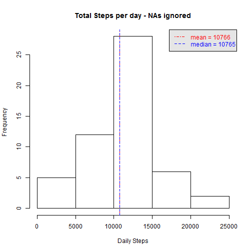
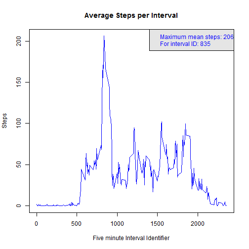
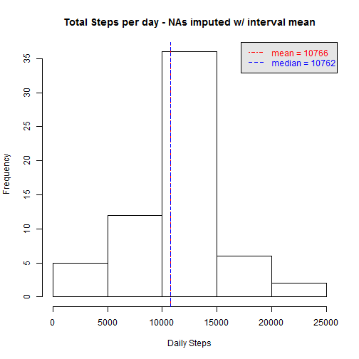
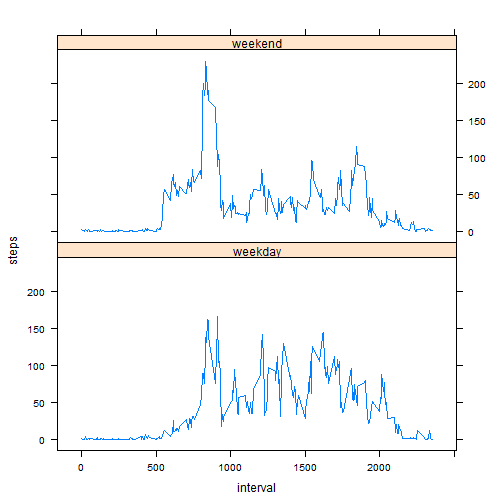

# Reproducible Research: Peer Assessment 1


```r
  require(knitr)
  opts_chunk$set(echo=TRUE)
```

## Loading and preprocessing the data

```r
  # The compressed zip archive
  zip_filename <- "activity.zip"

  # The data file stored inside the compressed zip archive
  data_filename <- "activity.csv"

  # Reading the data
  unzip(zip_filename)
  obs <- read.csv(data_filename)

  # Add weekend/weekday typing
  obs$day_type <- factor(ifelse(as.POSIXlt(obs$date)$wday %% 6, "weekend", "weekday"))

  # Aggregate by day
  steps_per_day <-   aggregate(steps ~ date, data = obs, sum)
  u_steps_per_day <- aggregate(steps ~ date, data = obs, mean)
  names(u_steps_per_day)[names(u_steps_per_day)=="steps"] <- "u_steps"

  # Aggregate by time and average
  u_steps_per_int <- aggregate(steps ~ interval, data = obs, mean)
   
  # Summarize the data
  summary(obs)
```

```
##      steps               date          interval       day_type    
##  Min.   :  0.0   2012-10-01:  288   Min.   :   0   weekday: 4608  
##  1st Qu.:  0.0   2012-10-02:  288   1st Qu.: 589   weekend:12960  
##  Median :  0.0   2012-10-03:  288   Median :1178                  
##  Mean   : 37.4   2012-10-04:  288   Mean   :1178                  
##  3rd Qu.: 12.0   2012-10-05:  288   3rd Qu.:1766                  
##  Max.   :806.0   2012-10-06:  288   Max.   :2355                  
##  NA's   :2304    (Other)   :15840
```

Observations: 17568  


## What is mean total number of steps taken per day?

```r
steps_hist <- function(steps, titlemod) {
  mean_steps_per_day <- mean(steps)
  median_steps_per_day <- median(steps)
  
  hist(steps, main=paste("Total Steps per day -",titlemod), 
       xlab="Daily Steps")
  abline(v=mean_steps_per_day, lty = 4, lwd = .1, col = "red", pch = 3)
  abline(v=median_steps_per_day, lty = 2, lwd = .1, col = "blue")
  legend("topright", c(paste("mean =",
                             format(round(mean_steps_per_day),scientific=FALSE)),
                       paste("median =",median_steps_per_day)
                       ), 
         col = c("red", "blue"), lty = c(4, 2),
         text.col=c("red", "blue"), bg = "gray90")
  data.frame(mean = c(mean_steps_per_day), median = c(median_steps_per_day))
}
na_measurements <- steps_hist(steps_per_day$steps, "NAs ignored")
```

 

## What is the average daily activity pattern?

```r
  plot(u_steps_per_int$interval, u_steps_per_int$steps, 
       main="Average Steps per Interval", 
       xlab="Five minute Interval Identifier", 
       ylab="Steps", 
       type="l",
       col="blue")

  maxes <- u_steps_per_int[u_steps_per_int$steps == max(u_steps_per_int$steps), ]
  n_maxes <- dim(maxes)[1]

  if (n_maxes == 1) {
    legend <- c(paste("Maximum mean steps:", round(maxes$steps)),
                paste("For interval ID:", maxes$interval))
  } else {
    legend <- c(paste("Maximum mean steps:", round(maxes$steps[1])),
                paste("For interval IDs:", paste(maxes$interval, collapse=" ")))
  }
  legend("topright", legend, bg = "gray90", text.col="blue")
```

 


## Imputing missing values

```r
  # plyr::join is needed for order preservation; otherwise merge() would do
  require(plyr)

  is_missing <- ! complete.cases(obs)
  n_missing <- sum(is_missing)

  # Missing steps get the interval means - assumes all desired days are present w/ NAs
  int_lookup <- u_steps_per_int
  names(int_lookup)[names(int_lookup)=="steps"] <- "u_steps"
  imputers <- join(obs[is_missing,], int_lookup, by="interval")
  imputed_obs <- obs
  imputed_obs$steps[is_missing] <- round(imputers$u_steps)

  imp_measurements <- steps_hist(
    aggregate(steps ~ date, data = imputed_obs, sum)$steps,
    "NAs imputed w/ interval mean")
```

 

```r
  measurements <- rbind(na_measurements, imp_measurements)
  row.names(measurements) <- c("NA_ignored", "NA_imputed")
  measurements
```

```
##             mean median
## NA_ignored 10766  10765
## NA_imputed 10766  10762
```
As shown in the table above, replacement of missing values by rounded interval
means has almost no effect on mean steps, and decreases the median steps slightly


## Are there differences in activity patterns between weekdays and weekends?

```r
  require(lattice)
  data_set_4 <- aggregate(steps ~ interval + day_type , data = imputed_obs, mean)
  xyplot(steps ~ interval | day_type, data = data_set_4, layout = c(1, 2), type="l")
```

 
  
